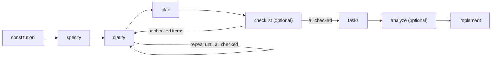
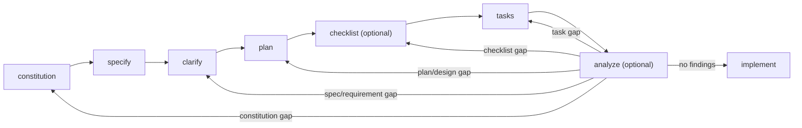

# Overview

This repo is a worked example of [GitHub Speckit](https://github.com/github/spec-kit) and
Spec-Driven Development (SDD): write and refine a spec first, then let it drive planning, task
breakdown, and implementation.

Read top to bottom — each step below corresponds to one branch, so you can follow the git history
alongside the writeup. Every step includes the raw slash-command prompt used.

TLDR;

```
constitution -> specify -> clarify -> plan -> checklist (optional, loop) -> tasks -> analyze (optional, loop) -> implement -> converge
```

## Prerequisites (branch name 00-speckit-initialize)

### 1. Install uv

Speckit's CLI (`specify`) runs via [uv](https://docs.astral.sh/uv/).

```bash
curl -LsSf https://astral.sh/uv/install.sh | sh
uv --version
```

### 2. Install the Specify CLI

Docs: [github/spec-kit](https://github.com/github/spec-kit)

```bash
uv tool install specify-cli --from git+https://github.com/github/spec-kit.git
```

Or run on demand without installing:

```bash
uvx --from git+https://github.com/github/spec-kit.git specify --help
```

### 3. Initialize Speckit in this repo

Ran `specify init .`. Generates:

- `.specify/` — constitution/memory, templates, scripts, workflow config
- `.claude/skills/` — Speckit slash-command skills for Claude

## Steps

> Commands below can be run in VS Code chat (Claude Code, Copilot, etc.) or via the `specify` CLI.

### 1. Generate the project constitution (`/speckit-constitution`, branch 01-speckit-constitution)

Derives `.specify/memory/constitution.md` from requirements — domain language, boundaries, and
standards only.

```
/speckit-constitution add constitution based on below requirements. Extract high-level domain rules and functional conventions—do not transcribe feature requirements directly.

Requirements:
We need a system that accepts bulk hardware orders from enterprise clients, calculates their final net totals using pre-negotiated contract discounts, and tracks each order through its lifecycle from intake to final delivery. Clients should be able to view their order history or cancel active requests.

**Extract & Add:**

* **Domain Language:** Glossary, domain-specific terminology, and abbreviations.
* **Governance & Boundaries:** Domain boundaries, data governance policies, and usage rules.
* **Standards:** Core standards and functional principles.

**Constraints:**

* Strictly exclude raw requirements, user stories, technical architecture, and implementation details.
```

### 2. Generate the feature specification (`/speckit-specify`, branch 02-speckit-specify)

Turns requirements into `spec.md` — user stories, functional requirements, success criteria.

```
/speckit-specify refer below requirements.md and create specification document

Requirements:
We need a system that accepts bulk hardware orders from enterprise clients, calculates their final net totals using pre-negotiated contract discounts, and tracks each order through its lifecycle from intake to final delivery. Clients should be able to view their order history or cancel active requests.
```

### 3. Clarify the feature specification (`/speckit-clarify`, branch 03-speckit-clarify)

Surfaces underspecified areas in `spec.md` — up to 5 targeted questions, then encodes accepted
answers back into `spec.md` (`## Clarifications`, plus Edge Cases/FRs/Key Entities/Assumptions).

#### No argument:

```
/speckit-clarify
```

#### Specific requirement:

```
/speckit-clarify As this is a sample/demo application, we do not want to implement authorization and authentication currently
```

#### Using Figma designs:

Can take a Figma HTML/CSS export as input — diffs it against the current spec/constitution and
asks about each real conflict or gap.

```
/speckit-clarify analyse the Figma design html specs/001-bulk-hardware-orders/figma-designs/create-order-page.html and add the information about the UI/UX to be same as html when it is implemented
```

#### Re-clarifying after designs change:

Re-running against an updated `figma-designs/` folder catches new drift — e.g. it caught new
undefined personas (Invoice Staff, Warehouse Operator), a reverted lifecycle stepper, a
single-page-to-two-page layout split, and newly-editable post-submission line items.

```
/speckit-clarify verify that the spec is matching the designs from html figma-designs folder
```

### 4. Generate the implementation plan (`/speckit-plan`, branch 04-speckit-plan)

Fills in Technical Context, runs a Constitution Check gate table, then Phase 0 research and
Phase 1 design:

- `plan.md` — Technical Context, Constitution Check (all 5 gates PASS), project structure
- `research.md` — Phase 0 decisions (trusted-header identity, optimistic locking, lifecycle
  enforcement, contract-terms lookup, etc.)
- `data-model.md` — Phase 1 entities, relationships, validation rules, state transitions
- `contracts/openapi.yaml` and `contracts/events.md` — REST API and RabbitMQ event contracts
- `quickstart.md` — Phase 1 end-to-end validation guide

#### With tech stack:

Tech stack and architecture decisions are too important to leave to an AI agent's guess, so that
info needs to be passed explicitly in the plan command. Speckit has no built-in command that
suggests a stack — instead, the current spec is used as context in a normal AI chat to define the
architecture and stack manually, then supplied to `/speckit-plan` directly:

```
/speckit-plan Stack:
- Backend: Java 25, Spring Boot 3.5 (Web, Validation, Data JPA, Actuator, AMQP/RabbitMQ), Maven, Lombok, Flyway, springdoc-openapi
- DB & Broker: PostgreSQL 17 (@Version optimistic locking), RabbitMQ
- Frontend: React 19, TypeScript, Vite, Tailwind
- Testing: JUnit 5, Mockito, AssertJ, Testcontainers | Vitest, RTL
- Infra: Docker (multi-stage), k3s / Rancher Desktop, Helm -> K8s

In Scope:
- Order API & DB: Order domain (intake, pricing, status lifecycle, cancellation, contract terms, history). Publishes `OrderIntaken` event to RabbitMQ.
- Message Queue: RabbitMQ broker.
- Portal UI: Enterprise Client dashboard + order create/detail views (role-gated shell).

Out of Scope (Future):
- Warehouse API / DB & Operator UI
- Invoicing API / DB & Staff UI
```

#### Revising the plan for a monorepo layout:

`/speckit-plan` can be re-run against an existing plan with new guidance instead of only from
scratch. Here, a follow-up prompt said the repo should be a monorepo housing order, warehouse,
and invoice APIs/frontends side by side. Re-running updated the artifacts in place:

- `plan.md` — `services/*` (one Maven module per API — `order-api` implemented,
  `warehouse-api`/`invoice-api` reserved) and `apps/*` (one app per portal — `order-portal`
  implemented, others reserved) under a root reactor `pom.xml`, with per-service Helm charts
- `research.md` — module-layout and deployment-path decisions revised in place, old decision
  kept visible alongside the new one
- `quickstart.md` — commands/paths updated to `services/order-api/` and `apps/order-portal/`

Scope is unchanged — only the order feature is implemented; Warehouse/Invoicing stay out of
scope as reserved directories.

```
/speckit-plan this is going to be a mono repo setup and will include order, warehouse and invoice apis and frontend
```

### 5. Generate a requirements checklist (`/speckit-checklist`, branch 05-speckit-checklist)

Creates a requirements-quality checklist for the feature. The checklist acts as "unit tests for
English": it evaluates whether requirements are complete, clear, consistent, measurable, and
ready for implementation. It does not test application behavior or implementation details.

Reviewer can open the generated checklist file in an editor. Add missing edge cases, modify vague criteria, or delete irrelevant checks.

The generated checklist is appended to
`specs/001-bulk-hardware-orders/checklists/requirements.md` and covers:

- Requirement completeness and clarity
- Pricing, lifecycle, concurrency, and data-ownership consistency
- Acceptance criteria and scenario coverage
- Edge cases, non-functional requirements, dependencies, and assumptions
- Ambiguities and conflicts that still need resolution

```
/speckit-checklist
```

Each unchecked item means the spec doesn't yet clearly answer that question. `/speckit-clarify`
resolves them (re-run it — up to 5 questions per pass — until every item is checked), then
`/speckit-plan` is re-run so the plan artifacts pick up the resulting spec changes:



```
/speckit-clarify
```

```
/speckit-plan
```

### 6. Generate the task list (`/speckit-tasks`, branch 06-speckit-tasks)

Turns the plan's design artifacts into `specs/001-bulk-hardware-orders/tasks.md` — a
dependency-ordered, checklist-formatted task breakdown grouped by user story (P1–P3) rather than
by layer, so each story can be built, tested, and demoed independently before the next one starts.

Reads `plan.md` (tech stack, structure), `spec.md` (user stories), and, where present,
`data-model.md`, `contracts/`, and `research.md` to produce:

- Phase 1 (Setup) and Phase 2 (Foundational) — shared scaffolding, schema/seed migrations,
  domain entities, identity handling, and lifecycle rules that block every story
- One phase per user story (Submit & Price, View History, Cancel, Operator Lifecycle
  Advancement) — each with its own tests and implementation tasks, independently testable
- A final Polish phase — Docker/Helm artifacts, remaining frontend coverage, full quickstart
  validation

```
/speckit-tasks
```

Every task is `- [ ] T### [P?] [Story?] Description with an exact file path`; `[P]` marks
tasks safe to run in parallel (different files, no unmet dependency), and `[US1]`–`[US4]` map a
task back to its user story. The MVP is Setup + Foundational + User Story 1 alone.

### 7. Analyze cross-artifact consistency (`/speckit-analyze`, branch 07-speckit-analyze)

Strictly read-only: cross-checks `spec.md`, `plan.md`, and `tasks.md` against each other and
against `.specify/memory/constitution.md` for duplication, ambiguity, underspecification,
constitution violations, coverage gaps, and inconsistency — without editing any file.

```
/speckit-analyze
```

Findings are normally reported in the terminal/chat output only, not persisted to the repo. Here
they were additionally written to `specs/001-bulk-hardware-orders/analysis-report.md`, ranked by
severity (CRITICAL/HIGH/MEDIUM/LOW), just to show what the report looks like. None are applied
automatically — fix wherever a finding is rooted, then loop forward again through the remaining
steps:



Re-run `/speckit-analyze` to confirm a finding is resolved.

In this case, `tasks.md` was the only artifact with a HIGH-severity gap, closed by running the
command below (commit `0033ceb`):

```
/speckit-tasks  edit tasks.md T063 to explicitly set net_total_locked_at on the SHIPPED transition (G1), and T038 to name the min-1-line-item validator (U1).
add a load-test task for SC-007 and timing assertions for SC-001 to tasks.md Phase 7, and a UI-action-count check to quickstart.md for SC-003.

```

### 8. Execute the implementation plan (`/speckit-implement`, branch 08-speckit-implement)

Works through `tasks.md` phase by phase — Setup, then Foundational, then each user story in
order — marking tasks `[X]` as done and pausing at checkpoints so each story can be tested
independently before the next one starts. Here it stopped after Setup, Foundational, and User
Story 1, delivering the MVP (bulk order intake and pricing).

```
/speckit-implement
```

### 9. Converge the codebase with the spec (`/speckit-converge`, branch 09-speckit-converge)

Diffs the implemented codebase against `spec.md`/`plan.md`/`tasks.md` and appends any remaining
gaps as new tasks (Phase 8: Convergence) in `tasks.md`, ready for another `/speckit-implement` pass.
Commit `4583334`.

```
/speckit-converge
```

Converge only adds tasks, it doesn't execute them — run `/speckit-implement` again to complete them
(commit `d77db02`).

```
/speckit-implement
```
